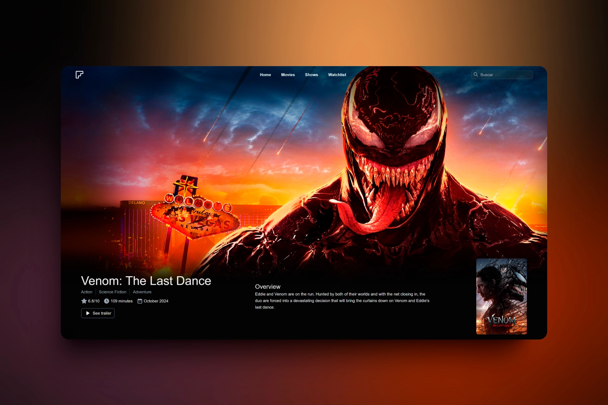

# Flix

Your go-to for movie and TV show info. Browse synopses, ratings, latest releases, and more. Stay updated and discover titles you can't miss.

Flix is a **Next.js** application that leverages the **TheMovieDB (TMDB) API** to deliver up-to-date information on movies and TV shows. It provides a seamless user experience with fast page loads, a responsive design, and an intuitive interface. The platform allows users to explore trending content, manage a personal wishlist, and stay informed about the latest releases.

## 🛠 Features

- 🔎 Search for movies and TV shows by name
- 📄 Detailed movie and TV show pages
- 📡 Find information about the latest movie releases
- 📱 Responsive design for all devices
- 📌 Create and manage your **wishlist** of favorite movies and shows

## 📦 Installation

1. Clone this repository:
   ```bash
   git clone https://github.com/your-username/flix.git
   cd flix
   ```

2. Install dependencies:
   ```bash
   npm install
   # or
   yarn install
   ```

3. Create a `.env.local` file and add the following variables:
   ```env
   NEXT_PRIVATE_API_READ_ACCESS_TOKEN=YOUR_ACCESS_TOKEN
   NEXT_PRIVATE_API_KEY=YOUR_TMDB_API_KEY
   ```

4. Start the development server:
   ```bash
   npm run dev
   ```


---

Enjoy [Flix](https://flix-git.vercel.app/)! 🍿🎬